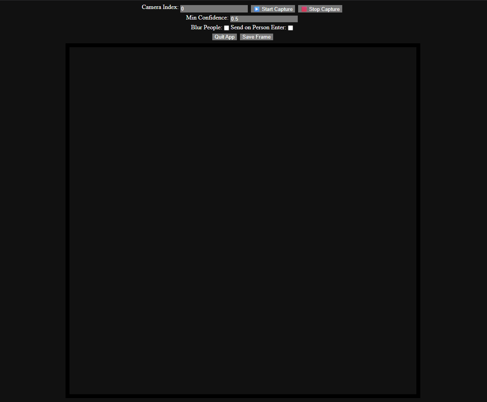

## user setup

run this in powershell after installing visual studio build tools with desktop development with c++, python 3.13, and python 3.9, and ffmpeg if using the "from video" script

```pwsh
git clone https://github.com/rsa17826/ai-img-detection.git ./ai-img-detection
cd ./ai-img-detection/object-detection
wget http://download.tensorflow.org/models/object_detection/ssd_mobilenet_v2_coco_2018_03_29.tar.gz -o ./zip.tar.gz
tar -xvzf zip.tar.gz --strip-components=1
rm ./zip.tar.gz
py -3.13 -m venv ./.venv
Set-ExecutionPolicy Bypass -Scope Process -Force
./.venv/Scripts/Activate.ps1
python -m pip install -r ./requirements.txt
python tf_text_graph_ssd.py --input frozen_inference_graph.pb --config pipeline.config --output graph.pbtxt

cd ..

cd ./person-recognition
py -3.9 -m venv ./.venv
./.venv/Scripts/Activate.ps1
pip install torch torchvision torchaudio --index-url https://download.pytorch.org/whl/cu121
pip install face_recognition facenet-pytorch opencv-python flask pandas numpy eel

cd ..

```

either run object-detection.ps1, person-recognition.ps1, or "from video.bat" "pathToVideo"

- if running object-detection.ps1, person-recognition.ps1

  - you should see http://127.0.0.1:15674 open in your default browser with ui used to control the python script


- if running person-recognition.ps1

  - to start using person-recognition first enable the correct camera, then press "add face to list" and enter the faces name
  - you can add more than 1 face under each name to make the detection more reliable
  - once a face is added it will be able to start detecting any faces that are in the face list and unknown for those that arnt in the face list
